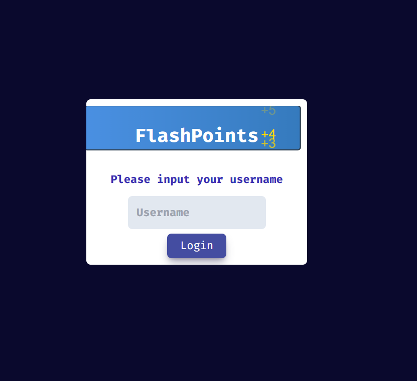

# Steps to Get This Project Working

1. **Change Directory to flashpoint**

   - Run `npm i`

2. **Expected Terminal Output**

   - A `leaderboard.db` file should be created in the Backend directory.
   - You should see the following messages in the terminal:

   ```
   > flashpoint@0.0.0 frontend
   > vite
   VITE v5.4.10 ready in 185 ms

    ➜ Local: http://localhost:5173/
    ➜ Network: use --host to expose
    ➜ press h + enter to show help
   ```

- Working endpoints
  - `/` (Public) This is the login page
  - `/dashboard` ( :lock: ) This is the dashboard with the decks displayed
  - `/deck/create` (Private) Deck creation (Not implemented yet)

3. If, by chance everything works then do the following - in the Frontend file directory, right click `index.html` and run Live Server. The following image should populate



- If it doesn't, just alt+F4 and skip this project
- If it does populate, go to step 5

4. Enter your name as the Username

## Functionality that works

- You can create decks and add flashcards with different points alloted.
- You can edit the Decks, but only able to edit the name of the deck, the category and add new flashcards.
- You can delete Decks and flashcards
- You can go through the flashcards and will either get a Correct/Incorrect response, and either gain points or not if the answer is right/wrong
- When you finish the deck, the score summary will calculate the points/percentage of correct answers
- you can click Test Score Submission to see the top scores adjust
- You can change themes from Light/Dark by clicking the Sun/Moon icon in the nav
- Your decks card count and total possible points are calculated properly
- You can signout properly

## Functionality that breaks

- Decks created are not persistent for each user when signed out. Need to debug userId => deck association :disappointed: :beetle:
- Score summary is not passed to `leaderboard.db` yet :beetle:
- Some multiple fetch issues with the Frontend fetching the Backend randomly :beetle:
- Also need to debug the settings theme toggle, doesn't want to work at the moment :beetle:
- Need to hide the top scores container when in settings :beetle:

```

```
