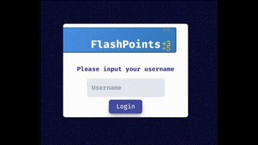

# Steps to Get This Project Working


1. **Starting server**

   - Clone project however you choose to do so
   - `cd flashpoint`
   - Run `npm i`
   - Run `npm run frontend`

2. **Expected Terminal Output**

   ```
   > flashpoint@0.0.0 frontend
   > vite
   VITE v5.4.10 ready in 185 ms

    ➜ Local: http://localhost:5173/
    ➜ Network: use --host to expose
    ➜ press h + enter to show help
   ```



- If it doesn't, just alt+F4 and skip this project
- If it does populate, go to step 3

3. Enter your name as the Username

## Functionality that works

- As of right now, I have had to hard code the Flashcards and their Decks. Will modify that in the future
- You can mark your answers as correct, or go to the next flashcard
- When you finish the deck, the score summary will calculate the points/percentage of correct answers
- Your decks card count and total possible points are calculated properly
- You can signout properly
- Working endpoints
  - `/` (🔓) This is the login page
  - `/dashboard` (🔒) This is the dashboard with the decks displayed
  - `/deck/create` (🔒) Deck creation (Not implemented yet)
  - `/deck/:deckId/:deckName` (🔒) View the deck
  - `/settings` (🔒) View the Settings page. Needs more work, kinda useless right now

## Functionality that breaks

- Refreshing the page returns you to the login screen.
- Cannot create new decks/flashcards at the moment
- Flashcards are not automatically validated as correct/incorrect yet.
- Cannot create/edit/delete decks yet
- Settings page is pretty much useless
